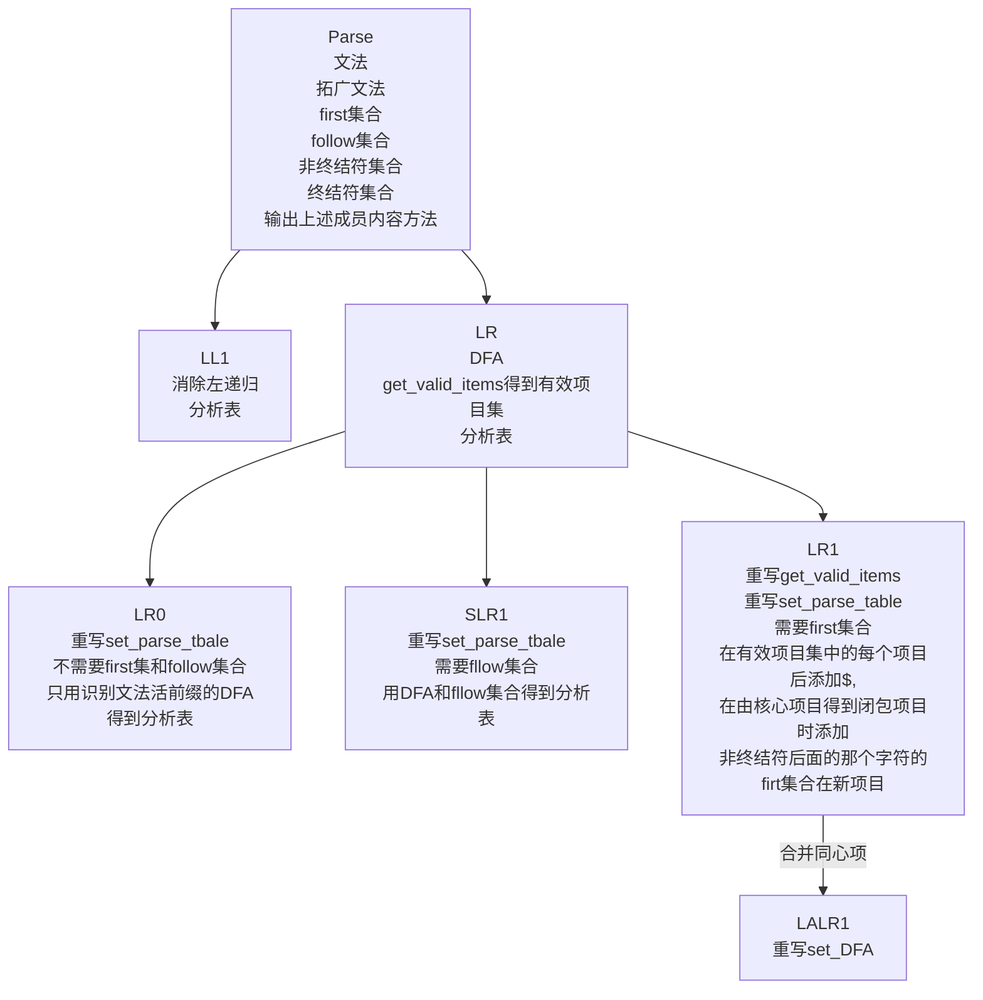

[TOC]
## 简介
这是2020年春季编译原理课程文法分析部分的作业，程序语言为C++，IDE为vs2019，其中的变量命名有一点点不规范，不过面向对象的设计思路自我觉得很赞，整个项目2000行代码作用。

LL文法可以消除简单左递归，直接左递归，一般左递归。而LR文法从原理上可以分析不经过消除一般左递归中的文法，但是我在实现上只能分析简单左递归和直接左递归文法，不能分析一般左递归文法，除非先消除一般左递归。原因是得到有效项目集时，有一般左递归时无法判断何时结束新的扩展。

## 文件目录
```
─Parse
    │  DFA.h                                //DFA所需的各种结构体和类
    │  input_bunch.txt                   //分析串输入文件
    │  input_grammar.txt                //分析文法
    │  LALR1.cpp                            //测试LALR1文件
    │  LALR1.h                               //LALR1头文件，下同
    │  LL1.cpp
    │  LL1.h
    │  LR.h
    │  LR0.cpp
    │  LR0.h
    │  LR1.cpp
    │  LR1.h
    │  Parse.h
    │  Parse.vcxproj
    │  Parse.vcxproj.filters
    │  Parse.vcxproj.user
    │  SLR1.cpp
    │  SLR1.h
```
## 类继承图


## 设计思路

1.  因为LL文法和LR文法及其衍生文法都有一些共同的特点或者所需要的共同操作，比如
    * 初始输入产生式
    * 最后生成的扩展文法
    * 非终结符和终结符
    * 分析时需要得到first集合和follow集合
    * 需要扩展文法
    * 一些公用的特殊字符，比如“空”，“->"
    所以将这些属性和动作抽象出来形成Parse类
2. LL1文法在继承Parse类的基础上需要增加以下功能:
    * 消除左递归
    * 形成自己的分析表，以非终结符为行，非终结符＋$为列
    * 用自己的分析表进行分析
3. LR0，SLR1，LR1，LALR1文法也有一些共性：
    * 都需要DFA来生成分析表
    * 分析表的行列结构都一样，只不过得出过程不一样和其分析表内容有些微差别
    * 都首先需要进行扩展文法
    * 分析串的过程都一样
   所以将这些都抽象出来形成一个LR文法，然后各文法在继承之后重写或者增加自己所需的一些操作就可以了。
4. LR0,SLR1，LR1，LALR1文法的不同之处：
    * LR0和SLR1的区别在于只是set_parse_table()时不同，LR0的DFA中只能有一个规约项，如果同时有两个规约项或者有规约有移进时就会分析时就会产生冲突，而SLR1中可以有多个规约项和移进项，分析表是根据DFA_item中的产生式前面的follow集合填写的。
    * LR1与上两者不同，一个是get_valie_items不同（得到有效项目集，会有一些标志符号在DFA的item后面，我用！来分隔开正常的产生式和标志符号）不同，LR1中的！后面的标志符号还根据标志符号串的first集合来更改（遇到非终结符做DFA项目的拓展时）。所以相应的还必须增加新的get_first方法，这个方法需要剔除标志串中的分隔符然后再得到first集合。另一个是set_parse_table不同，LR1根据标志串填写在相应的列中，不再是用前面的A -> 空的A的follow集合（与SLR相比）和此状态的所有行（与LR0相比）。
    * LALR1只是合并了LR1中的同心项，其他的与LR1相同。

## 注释
1. 每个cpp文件编译运行后默认从当前文件夹下的input_grammar.txt和input_bunch.txt文件读入文法和分析串，input_grammar.txt的格式为**非终结符 -> 非终结符和终结符串** 其中非终结符和终结符串中不同类型的要用**空格**隔开,例如*A -> B d | c*，每一行填写一行文法，最后一行为*exit*。input_bunch类似，非终结符和终结符串隔开，最后一行为exit。
例如：
```
B -> b B | d D b
D -> a D | #
exit
```
```
b d b
exit
```
2. 如果想从命令行中输入的画，注释掉cpp文件中的input_by_file两条语句，打开input语句即可。
3. 文法中的空用 **#** 来代替。
